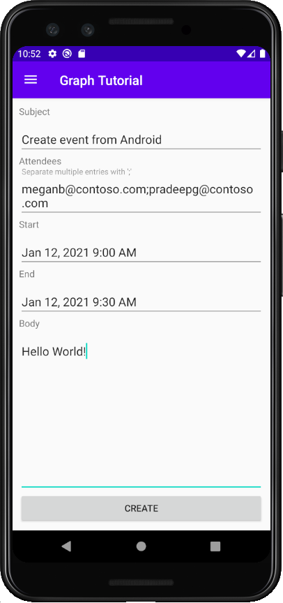

<!-- markdownlint-disable MD002 MD041 -->

<span data-ttu-id="e043d-101">このセクションでは、ユーザーの予定表にイベントを作成する機能を追加します。</span><span class="sxs-lookup"><span data-stu-id="e043d-101">In this section you will add the ability to create events on the user's calendar.</span></span>

1. <span data-ttu-id="e043d-102">**GraphHelper を開** き、ファイルの一番上に次 `import` のステートメントを追加します。</span><span class="sxs-lookup"><span data-stu-id="e043d-102">Open **GraphHelper** and add the following `import` statements to the top of the file.</span></span>

    ```java
    import com.microsoft.graph.models.extensions.Attendee;
    import com.microsoft.graph.models.extensions.DateTimeTimeZone;
    import com.microsoft.graph.models.extensions.EmailAddress;
    import com.microsoft.graph.models.extensions.ItemBody;
    import com.microsoft.graph.models.generated.AttendeeType;
    import com.microsoft.graph.models.generated.BodyType;
    ```

1. <span data-ttu-id="e043d-103">次の関数をクラスに追加 `GraphHelper` して、新しいイベントを作成します。</span><span class="sxs-lookup"><span data-stu-id="e043d-103">Add the following function to the `GraphHelper` class to create a new event.</span></span>

    :::code language="java" source="../demo/GraphTutorial/app/src/main/java/com/example/graphtutorial/GraphHelper.java" id="CreateEventSnippet":::

## <a name="update-new-event-fragment"></a><span data-ttu-id="e043d-104">新しいイベント フラグメントを更新する</span><span class="sxs-lookup"><span data-stu-id="e043d-104">Update new event fragment</span></span>

1. <span data-ttu-id="e043d-105">**app/java/com.example.graphtu読み込み** フォルダーを右クリックし、[新規] を選択し、[クラス] **Javaします**。</span><span class="sxs-lookup"><span data-stu-id="e043d-105">Right-click the **app/java/com.example.graphtutorial** folder and select **New**, then **Java Class**.</span></span> <span data-ttu-id="e043d-106">クラスに名前を付 `EditTextDateTimePicker` け **、[OK] を選択します**。</span><span class="sxs-lookup"><span data-stu-id="e043d-106">Name the class `EditTextDateTimePicker` and select **OK**.</span></span>

1. <span data-ttu-id="e043d-107">新しいファイルを開き、その内容を次のファイルに置き換えてください。</span><span class="sxs-lookup"><span data-stu-id="e043d-107">Open the new file and replace its contents with the following.</span></span>

    :::code language="java" source="../demo/GraphTutorial/app/src/main/java/com/example/graphtutorial/EditTextDateTimePicker.java" id="DateTimePickerSnippet":::

    <span data-ttu-id="e043d-108">このクラスは、コントロールをラップし、ユーザーがコントロールをタップすると日付と時刻の選択コントロールを表示し、日付と時刻を選択して値を `EditText` 更新します。</span><span class="sxs-lookup"><span data-stu-id="e043d-108">This class wraps an `EditText` control, showing a date and time picker when the user taps it, and updating the value with the date and time picked.</span></span>

1. <span data-ttu-id="e043d-109">アプリ **/res/layout/fragment_new_event.xml開** き、その内容を次の内容に置き換えてください。</span><span class="sxs-lookup"><span data-stu-id="e043d-109">Open **app/res/layout/fragment_new_event.xml** and replace its contents with the following.</span></span>

    :::code language="xml" source="../demo/GraphTutorial/app/src/main/res/layout/fragment_new_event.xml":::

1. <span data-ttu-id="e043d-110">**NewEventFragment を** 開き、ファイルの上部に `import` 次のステートメントを追加します。</span><span class="sxs-lookup"><span data-stu-id="e043d-110">Open **NewEventFragment** and add the following `import` statements at the top of the file.</span></span>

    ```java
    import android.util.Log;
    import android.widget.Button;
    import com.google.android.material.snackbar.BaseTransientBottomBar;
    import com.google.android.material.snackbar.Snackbar;
    import com.google.android.material.textfield.TextInputLayout;
    import com.microsoft.graph.concurrency.ICallback;
    import com.microsoft.graph.core.ClientException;
    import com.microsoft.graph.models.extensions.Event;
    import com.microsoft.identity.client.AuthenticationCallback;
    import com.microsoft.identity.client.IAuthenticationResult;
    import com.microsoft.identity.client.exception.MsalException;
    import java.time.ZoneId;
    import java.time.ZonedDateTime;
    ```

1. <span data-ttu-id="e043d-111">次のメンバーをクラスに追加 `NewEventFragment` します。</span><span class="sxs-lookup"><span data-stu-id="e043d-111">Add the following members to the `NewEventFragment` class.</span></span>

    :::code language="java" source="../demo/GraphTutorial/app/src/main/java/com/example/graphtutorial/NewEventFragment.java" id="InputsSnippet":::

1. <span data-ttu-id="e043d-112">進行状況バーを表示または非表示にする次の関数を追加します。</span><span class="sxs-lookup"><span data-stu-id="e043d-112">Add the following functions to show and hide a progress bar.</span></span>

    :::code language="java" source="../demo/GraphTutorial/app/src/main/java/com/example/graphtutorial/NewEventFragment.java" id="ProgressBarSnippet":::

1. <span data-ttu-id="e043d-113">次の関数を追加して、入力コントロールから値を取得し、関数を呼び出 `GraphHelper.createEvent` します。</span><span class="sxs-lookup"><span data-stu-id="e043d-113">Add the following functions to get the values from the input controls and call the `GraphHelper.createEvent` function.</span></span>

    :::code language="java" source="../demo/GraphTutorial/app/src/main/java/com/example/graphtutorial/NewEventFragment.java" id="CreateEventSnippet":::

1. <span data-ttu-id="e043d-114">既存のファイルを次 `onCreateView` のコードに置き換える。</span><span class="sxs-lookup"><span data-stu-id="e043d-114">Replace the existing `onCreateView` with the following.</span></span>

    :::code language="java" source="../demo/GraphTutorial/app/src/main/java/com/example/graphtutorial/NewEventFragment.java" id="OnCreateViewSnippet":::

1. <span data-ttu-id="e043d-115">変更内容を保存し、アプリを再起動します。</span><span class="sxs-lookup"><span data-stu-id="e043d-115">Save your changes and restart the app.</span></span> <span data-ttu-id="e043d-116">[新しい **イベント] メニュー** 項目を選択し、フォームに入力して、[作成] を選択 **します**。</span><span class="sxs-lookup"><span data-stu-id="e043d-116">Select the **New Event** menu item, fill in the form, and select **CREATE**.</span></span>

    
